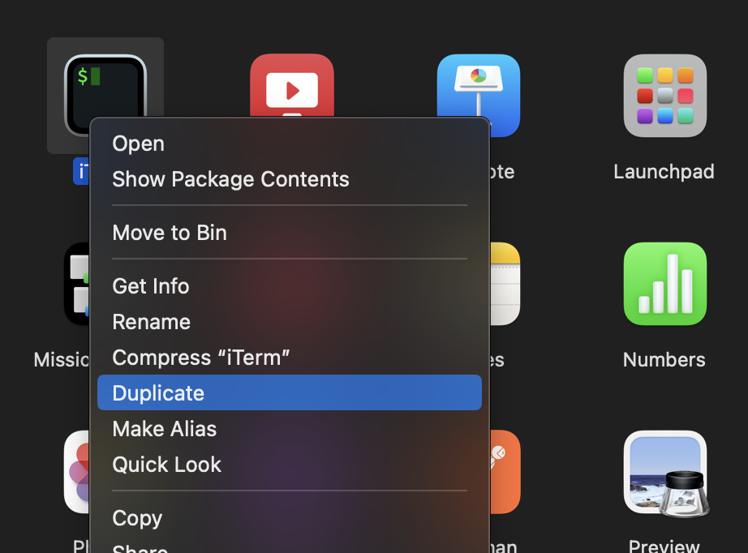
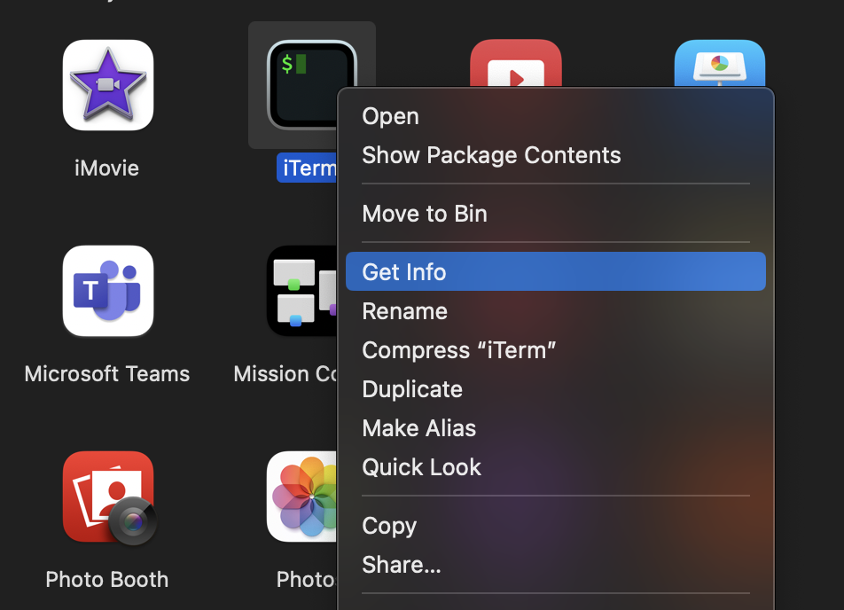
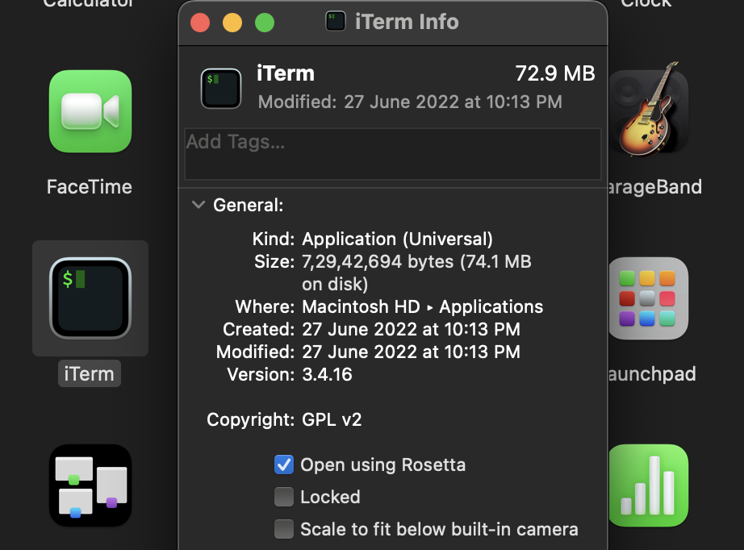

# Local Environment Setup Guide on Apple Silicon(M1 ARM Architecture) for Python Runtime

***Azure Function local environment for Python runtime not yet supported on arm64 architecture.<br> Here is the workaround for it...***

## Install *Rosetta*
*Rosetta* emulates `x86_64` architecture on Apple Silicon chip.

- To install Rosetta
```bash
$ softwareupdate --install-rosetta --agree-to-license
```
- Create duplicate (call it `rosettaTerm`) of *Terminal* or *iTerm* to open it using Rosetta, which should provide `x86_64` arch environment.






## Install required packages
Open `rosettaTerm` and follow along...

- Get *Homebrew* for `x86_64` architecture
```bash
$ arch -x86_64 /bin/bash -c "$(curl -fsSL https://raw.githubusercontent.com/Homebrew/install/master/install.sh)"

# Add this to .bashrc/.zshrc 
$ echo 'eval "$(/usr/local/bin/brew shellenv)"' >> ~/.zprofile
$ eval "$(/usr/local/bin/brew shellenv)" 
```

- To manage seperate environments for Python we will be using *Miniconda*.
```bash
# Install miniconda
$ wget https://repo.anaconda.com/miniconda/miniconda3-latest-MacOSX-x86_64.sh
$ sh ./miniconda3-latest-MacOSX-x86_64.sh

# Add this to .bashrc/.zshrc 
$ eval "$(~/miniconda/bin/conda shell.zsh hook)" 
```
- Create new `conda` environment named `rosetta` with Python3.9 and activate it.
```bash
$ CONDA_SUBDIR=osx-64 conda create -n rosetta python=3.9
$ conda activate rosetta
```

## Install required Azure tools
Open `rosettaTerm` and follow along...

- Install Azure Function Core Tools using `brew`
```bash
$ arch -x86_64 brew tap azure/functions
$ arch -x86_64 brew install 
azure-functions-core-tools@4
$ npm install -g azurite # You may need to install npm if not already
```

- Install Azure CLI
```bash
$ arch -x86_64 brew update && arch -x86_64 brew install azure-cli
```


