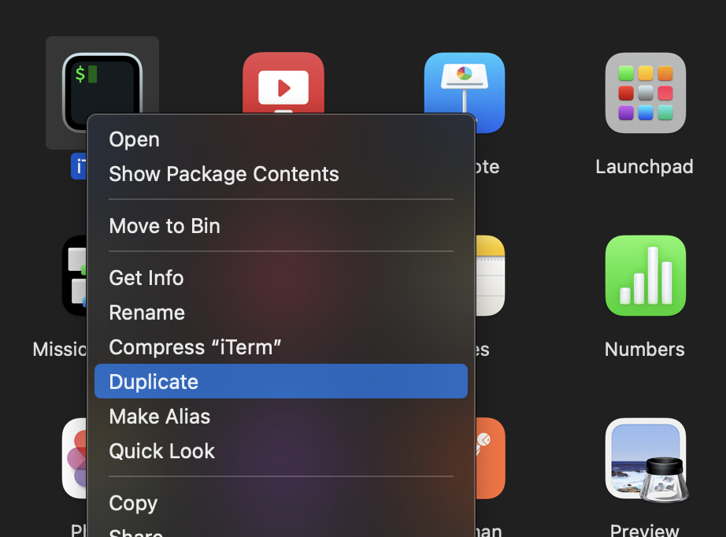

# Azure Function App Demo Project
---
## Local Environment Setup (MacOS M1/ARM Architecture )

***Azure Function local environment for Python runtime not yet supported on arm64 architecture.<br> Here is the workaround for it...***

### Install *Rosetta*
*Rosetta* emulates `x86_64` architecture on Apple Silicon chip.

- To install Rosetta
```bash
$ softwareupdate --install-rosetta --agree-to-license
```
- Create duplicate (call it `rosettaTerm`) of *Terminal* or *iTerm* to open it using Rosetta, which should provide `x86_64` arch environment.




### Install required packages
Open `rosettaTerm` and follow along...


